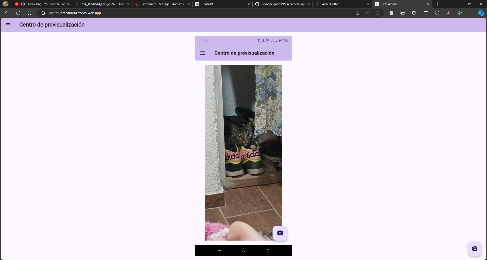
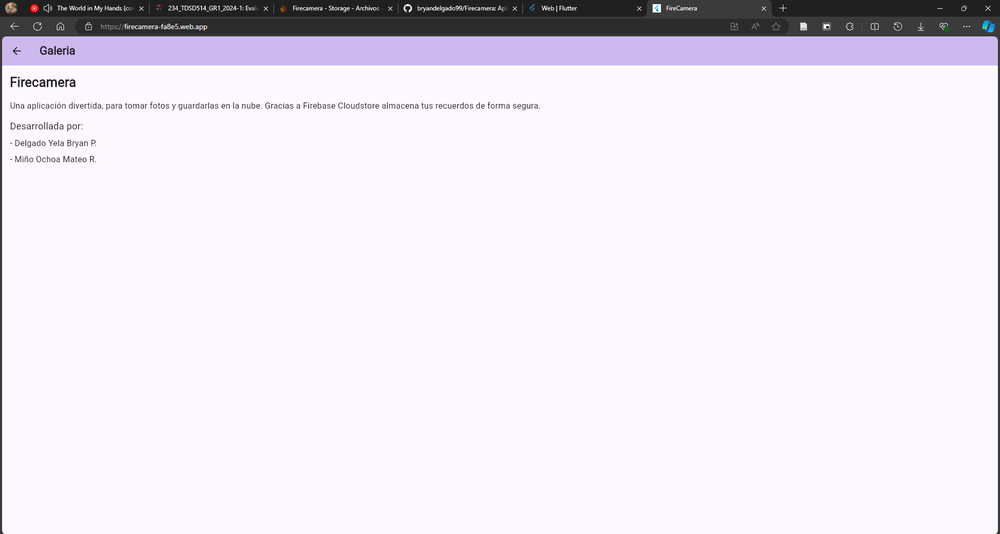

# 🖼️🔥 Firecamera

Una aplicación de fotografía y previsualización de imágenes, desarrollada con Flutter y Firebase.


## 📒 Funciones

- Envia fotos de manera local o tomadas con la cámara de tus dispositivo
- Visualiza las fotografías que se hayan subido al Storage de Firebase.

## 💻 Tecnologías

**😀 Cliente:**
Flutter - Android - Webkits - Firebase

[](https://skillicons.dev)

**🖥️ Servidor:**
Servicios de Firebase: Storage y Hosting

[](https://skillicons.dev)

## ⏬ Instalacion

Clona el proyecto

```bash
  git clone https://github.com/bryandelgado99/Firecamera.git
```
o, si usas GitHub CLI:

```bash
  gh repo clone bryandelgado99/Firecamera
```

Ve a la carpeta del proyecto

```bash
  cd Firecamera
```

Instala las dependencias necesarias para el proyecto de Flutter

```bash
  flutter pub get
```

## 🛑 ADVERTENCIA

Revisa que tengas instalado Firebase en tu equipos, sino, usa el comando:

```bash
  npm install -g firebase-tools
```

Inicializa la aplicación con los siguientes comandos:

```bash
  flutter run --web / flutter run
```

>[!IMPORTANT]
>Recuerda que para probar la apliación en un dispositivo Android, debes conectar tu equipo en modo de *Depuración USB* o *Depuración Inalámbrica*.
>También puedes crear un dispositivo virtual, en base los componentes y recursos de tu equipo.

## 🍃 Variables de Entorno

Para ejecutar este proyecto necesitaras dirijirte a archivo .env y colocar tus variables de entorno de la siguiente manera:

```Firebase Options
    apiKey: 'API_KEY',
    appId: 'APP_ID',
    messagingSenderId: 'MESSAGE_SENDER',
    projectId: 'PROJECT_ID',
    storageBucket: 'STORAGE_URL',
```
## 🧩 Uso/Ejemplos

### 😀 inicio de la aplicación  


### ✍️ Menú de navegación  


### 📲 Subida de imágenes  


### 📲 Pasarela de imágenes  


### 📲 Demostración Web  


### 📲 Información de la aplicación  


## 🌎 Demo

Si quieres probar la aplicación puedes hacerlo desde el siguiente enlace:

[Despliegue Web con Flutter](https://firecamera-fa8e5.web.app/)

O si quieres probar el proyecto en Moviles puedes hacerlo desde aqui para descargar la APK

[Descarga el APK](https://github.com/bryandelgado99/Firecamera/releases/tag/1.0.0)
